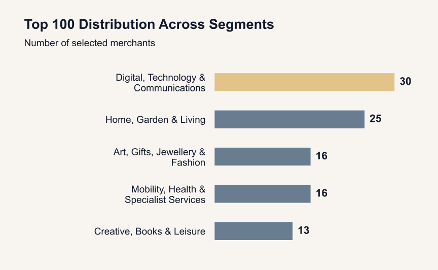
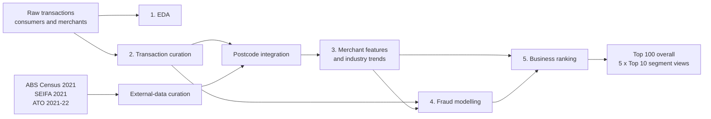

# MAST30034 Project 2 — Risk-Aware BNPL Merchant Ranking

This project builds an interpretable decision-support pipeline for a Buy Now, Pay Later
(BNPL) provider. It combines transaction performance, customer reach, growth, stability,
regional market context and modelled fraud risk to answer one practical question:

> **Which merchants should a BNPL provider prioritise for onboarding?**

The final deliverables are an overall **Top 100 merchant shortlist** and **Top 10 views
for each of five industry segments**. The ranking supports prioritisation; it does not
predict profit, guarantee onboarding success or prove that a merchant is fraudulent.

## Start here

| Need | File |
|---|---|
| Read the project and fraud-analysis walkthrough | [`notebook.ipynb`](notebook.ipynb) |
| Inspect the final overall shortlist | [`member5_ranking/results/final_top_100.csv`](member5_ranking/results/final_top_100.csv) |
| Inspect the five segment-level Top 10 views | [`member5_ranking/results/segment_top_10.csv`](member5_ranking/results/segment_top_10.csv) |
| Inspect all eligible merchants and their scores | [`member5_ranking/results/ranking_analysis_base.csv`](member5_ranking/results/ranking_analysis_base.csv) |
| Inspect merchant fraud scores and reliability | [`member4_fraud/result/knn_fraud_risk_scores.csv`](member4_fraud/result/knn_fraud_risk_scores.csv) |
| Understand the final ranking method | [`member5_ranking/README.md`](member5_ranking/README.md) |



## Project workflow



## Data and headline results

| Item | Result |
|---|---:|
| Transactions analysed | 14,195,505 |
| Consumers | 499,999 |
| Observed merchants | 4,422 |
| Merchants eligible for comparable final ranking | 4,026 |
| Transaction period | 2021-02-28 to 2022-10-26 |
| Combined external-data match rate by transaction count | 80.77% |
| Merchants with direct fraud observations | 61 |
| Merchants receiving a KNN risk score | 4,422 |
| Merchants flagged outside the labelled sample's distance support | 1,763 |
| Final recommendation outputs | Top 100 overall + 10 in each of 5 segments |

The 396 observed merchants excluded from final ranking lack required merchant-master
information such as category or take rate. Their exclusion is a data-comparability rule,
not evidence that they are unsuitable.

## Repository guide

| Stage | Location | Purpose | Main output |
|---|---|---|---|
| Exploratory analysis | [`member1_eda/`](member1_eda/) | Validate the supplied tables and describe transaction, consumer and merchant patterns | EDA figures and audit summaries |
| Transaction curation | [`member2_curation/`](member2_curation/) | Clean, join and quality-check the internal tables | `curated_transactions/` generated locally |
| Census curation | [`external_census/`](external_census/) | Build postcode-level demographic and labour-market features | `census_clean.parquet` |
| SEIFA curation | [`external_seifa/`](external_seifa/) | Build postcode-level socio-economic indexes | `seifa_clean.parquet` |
| ATO curation | [`external_ato/`](external_ato/) | Build postcode-level regional income and tax features | `ato_clean.parquet` |
| External integration | [`external_integration/`](external_integration/) | Combine Census, SEIFA and ATO and audit postcode coverage | `external_postcode_features.parquet` |
| Merchant features | [`member3_merchant_features/`](member3_merchant_features/) | Aggregate commercial, behavioural and customer-area features to one row per merchant | `merchant_features.parquet` |
| Industry analysis | [`member3_industry_growth/`](member3_industry_growth/) | Group merchants into five segments and analyse historical revenue patterns | Industry summaries and charts |
| Fraud modelling | [`member4_fraud/`](member4_fraud/) | Model consumer and merchant risk and quantify score reliability | `knn_fraud_risk_scores.csv` |
| Ranking | [`member5_ranking/`](member5_ranking/) | Combine business performance and fraud safety into final recommendations | `final_top_100.csv`, `segment_top_10.csv` |

Each module contains its own README, validation notes, requirements and tests where
applicable. Small audit tables and presentation-ready outputs are committed; large raw
or reproducible intermediate datasets are not.

## Merchant scoring method

All business inputs are converted to percentile scores within the eligible merchant
pool. The locked business score is:

```text
BusinessScore = 0.30 Value
              + 0.25 Customer Reach
              + 0.20 Growth
              + 0.15 Stability
              + 0.10 Market Context

FinalScore = 0.90 BusinessScore + 0.10 FraudSafety
```

| Component | Input | Direction | Effective final weight |
|---|---|---:|---:|
| Value | Estimated historical BNPL revenue | Higher is preferred | 27.0% |
| Customer Reach | Unique historical consumers | Higher is preferred | 22.5% |
| Growth | Normalised monthly revenue trend | Higher is preferred | 18.0% |
| Stability | Monthly revenue coefficient of variation | Lower is preferred | 13.5% |
| Market Context | Transaction-weighted SEIFA IRSAD national decile | Higher is the chosen contextual preference | 9.0% |
| FraudSafety | Reversed combined fraud-risk index | Higher indicates lower relative modelled risk | 10.0% |

Growth and stability use complete calendar months from **2021-03 to 2022-09**.
Missing months inside a merchant's observed activity span are treated as zero revenue;
the two partial boundary months are not treated as complete months.

## Fraud model

Fraud work is contained in [`member4_fraud/`](member4_fraud/). Run the notebooks in
this order:

1. [`consumer_fraud_analysis.ipynb`](member4_fraud/code/consumer_fraud_analysis.ipynb)
2. [`merchant_fraud_analysis.ipynb`](member4_fraud/code/merchant_fraud_analysis.ipynb)
3. [`fraud_risk_profile.ipynb`](member4_fraud/code/fraud_risk_profile.ipynb)

The selected merchant model is a K-Nearest Neighbours regression pipeline with:

- power transformation;
- fold-local mutual-information selection of 8 features;
- `K = 8`;
- Manhattan distance (`p = 1`); and
- distance weighting.

Model selection compared KNN with XGBoost, Random Forest, Linear Regression and a mean
baseline. KNN was selected primarily by repeated-CV Spearman rank correlation, with MAE
and RMSE as tie-breakers.

| Validation view | Spearman | MAE | RMSE |
|---|---:|---:|---:|
| Repeated cross-validation | 0.6767 | 0.0925 | 0.1376 |
| Nested cross-validation | 0.6458 | 0.1080 | 0.1492 |
| Leave-one-merchant-out sensitivity | 0.7118 | 0.0838 | 0.1398 |
| Independent 13-merchant holdout | 0.4231 | 0.1140 | 0.1865 |

The lower holdout result and the variation across validation procedures are retained
because only 61 merchants have direct labels. The KNN score is therefore a relative
ranking signal, not a calibrated fraud probability.

The neutral risk index used downstream is:

```text
FraudRisk = 0.50 ConsumerExposurePercentile
          + 0.50 KNNMerchantRiskPercentile

FraudSafety = 100 x (1 - FraudRisk)
```

The project also keeps 70/30 and 30/70 consumer/KNN scenarios for sensitivity analysis.
Neighbour-distance diagnostics are carried into the final ranking through
`knn_confidence_score` and `knn_out_of_distribution`; confidence measures similarity to
the labelled sample, not prediction accuracy.

## Reproducing the analysis

### 1. Prepare the supplied data

Raw course data are not stored in Git. Place the supplied files under `tables/`, or set
`PROJECT2_DATA_ROOT` to the extracted tables directory. The expected inputs include:

```text
tables/
├── tbl_consumer.csv
├── consumer_user_details.parquet
├── tbl_merchants.parquet
└── transactions_*_snapshot/
    └── order_datetime=*/part-*.parquet
```

Official Census, SEIFA and ATO source files are documented inside their respective
external-data folders. Postcodes must remain zero-padded four-character strings.

### 2. Use module-specific environments

Different stages retain tested dependency versions, so install the requirements for the
stage being reproduced rather than replacing them with one global environment. For
example:

```bash
python -m venv .venv
# macOS/Linux: source .venv/bin/activate
# Windows PowerShell: .venv\Scripts\Activate.ps1
python -m pip install -r member2_curation/requirements.txt
```

### 3. Follow the dependency order

| Order | Action | Instructions |
|---:|---|---|
| 1 | Run EDA | [`member1_eda/README_member1.md`](member1_eda/README_member1.md) |
| 2 | Build curated transactions | [`member2_curation/README.md`](member2_curation/README.md) |
| 3 | Rebuild Census, SEIFA and ATO postcode tables if required | [`external_census/README.md`](external_census/README.md), [`external_seifa/README.md`](external_seifa/README.md), [`external_ato/README.md`](external_ato/README.md) |
| 4 | Combine and validate external features | [`external_integration/README.md`](external_integration/README.md) |
| 5 | Build merchant features and industry summaries | [`member3_merchant_features/README.md`](member3_merchant_features/README.md), [`member3_industry_growth/README.md`](member3_industry_growth/README.md) |
| 6 | Run the three fraud notebooks in order | [`member4_fraud/README.md`](member4_fraud/README.md) |
| 7 | Run `ranking_summary.ipynb`, then `final_recommendations.ipynb` | [`member5_ranking/README.md`](member5_ranking/README.md) |

Do not reuse downstream files after a failed or partial upstream run. The ranking and
curation stages include consistency assertions to stop on stale or incompatible inputs.

## Output finder

| Output | Meaning |
|---|---|
| [`merchant_features.parquet`](member3_merchant_features/results/merchant_features.parquet) | One row per merchant with commercial, behavioural and regional features |
| [`merchant_model_comparison.csv`](member4_fraud/result/merchant_model_comparison.csv) | KNN and alternative-model validation results |
| [`merchant_nested_cv_summary.csv`](member4_fraud/result/merchant_nested_cv_summary.csv) | Outer-fold estimate of the complete model-selection procedure |
| [`knn_fraud_risk_scores.csv`](member4_fraud/result/knn_fraud_risk_scores.csv) | KNN risk, consumer exposure, combined scenarios and reliability fields |
| [`ranking_analysis_base.csv`](member5_ranking/results/ranking_analysis_base.csv) | Full eligible candidate pool with component and final scores |
| [`final_top_100.csv`](member5_ranking/results/final_top_100.csv) | Official overall shortlist |
| [`segment_top_10.csv`](member5_ranking/results/segment_top_10.csv) | Top 10 within each of five industry views |
| [`final_business_sensitivity_summary.csv`](member5_ranking/results/final_business_sensitivity_summary.csv) | Stability of recommendations under alternative business weights |
| [`top100_knn_reliability_summary.csv`](member5_ranking/results/top100_knn_reliability_summary.csv) | KNN support and out-of-distribution diagnostics in the selected pool |

## Interpretation and responsible use

- `FinalScore` is a transparent prioritisation rule, not a forecast of future profit.
- `fraud_risk_index` is a relative model signal, not an observed fraud rate or evidence
  of wrongdoing.
- Direct fraud evidence is sparse. Out-of-distribution and low-confidence cases require
  manual review rather than automatic approval or rejection.
- Census, SEIFA and ATO features describe postcode areas, not individual consumers or a
  merchant's physical location.
- External sources use different reference periods and are applied retrospectively.
- The five segment lists are views of the overall candidate pool, not 50 additional
  onboarding slots; all 50 segment selections are already present in the overall Top 100.
- Weight sensitivity measures robustness to chosen assumptions. It does not identify an
  objectively optimal set of business weights.

## Data privacy and repository policy

The repository does not publish the supplied raw consumer or transaction tables. Large
transaction outputs, model binaries, temporary databases and local environments are
excluded through [`.gitignore`](.gitignore). Committed outputs are aggregated summaries,
model diagnostics, postcode-level public-data features and merchant-level recommendation
tables required for project review and reproducibility.
